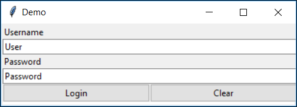
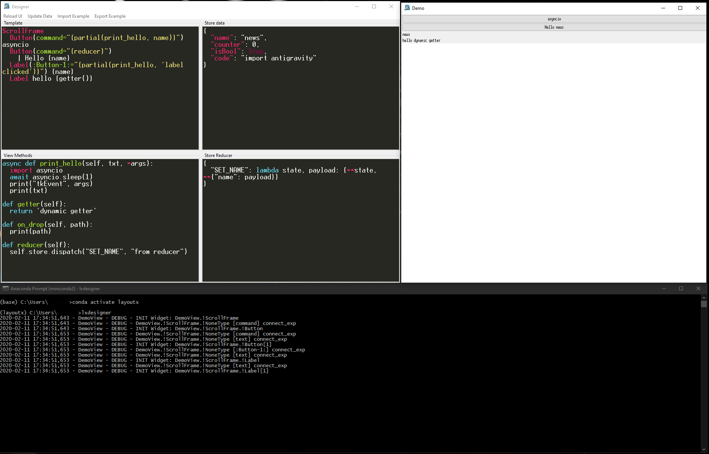
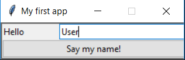
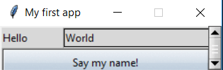

## Why
Python has multiple solutions to develop GUI applications e.g. PyQT5, tkinter, wx, etc.
But often you end up with a lot of spaghetti to create the GUI and connect it to your data.
This code is tedious to program, hard to maintain and its missing a quick preview function.

So instead wouldn't it be nice to just write:

``` pug tab="Layout"
ScrollFrame
  Label Username
  Input(value="{{username}}")
  Label Password
  Input(value="{{password}}")
  Box(orient="horizontal")
    Button(command="{login}") Login
    Button(command="{clear}") Clear
```

``` json tab="Data"
{
  'username': 'User',
  'password': 'Password',
}
```

That creates the following application:


Take a look at the curly brackets in the `value` property. Here you directly bind the widgets to your data.

## Features
- Drag and Drop support (tkDnD)
- Supports async by default (powered by asyncio)
- Two-way data binding
- Flexible layout by design
- Application scrolls automatically
- Simple layout syntax powered by Pug (former Jade)
- Widget parameter support inline python scripting
- ttk themes included
- Lightweight and fast
- Add any custom tkinter widget

## Installation
Use pip to get the latest version.

```pip install layoutx``` (minimal version)

```pip install layoutx[more_widgets, styles]``` (full version)

```python -m layoutx.install_tkdnd``` (install tkdnd)

After installing the basic library, the setup will check if **tkDnD** is already installed. If not, it is fetched and installed automatically. (Currently does not work for MacOS X, please create a PR, as I have no Mac to test the coding)

Additionally the command line tool: `lxdesigner` is installed.

!!! danger
    The designer needs the addon **more_widgets** installed in order to function

## Addons
Some dependencies of this project have a GPL v3 license. They are excluded into separate addons.
Please note by installing these dependencies, you confirm to the GPL license agreement.

This project itself is licensed under MIT.

### more widgets:
More information see: [ttkwidgets Github](https://github.com/TkinterEP/ttkwidgets/)

 - Input
 - ComboBox
 - TextArea
 - Scale

```pip install layoutx[more_widgets]```

### ttk themes:
More information see: [ttkthemes Github](https://github.com/TkinterEP/ttkthemes)

```pip install layoutx[styles]```

## Integrated Designer
If you want to create a simple mockup for your application, use the integrated designer with terminal command:

```lxdesigner```



The Designer is entirely written with **LayoutX** and a good example, how easily dynamic GUIs can be created. 

The designer will display any error and debug information in the terminal window.

## Your first application

``` python
from layoutx        import app # Import the app singleton
from layoutx.store  import create_store
from layoutx.view   import View, ResizeOption

store = create_store({}, { "name": "World" })

class RootView(View):
  geometry = "250x50+100+100"
  title = "My first app"
  resizable = ResizeOption.NONE
  template = """\
ScrollFrame
  Box(orient="horizontal")
    Label Hello
    Input(value="{{name}}")
  Button(command="{say_my_name}") Say my name!
"""
  def say_my_name(self):
    print(self.store.state["name"])

if __name__ == "__main__":
  app.setup(store=store, rootView=RootView)
  app.run()
```



Pressing the button will print: `User`

We now have build a python cross-platform GUI with a vue-like template declaration and a redux data store in only 22 lines of code. 

In the next chapter the frameworks architecture is explained into detail.

## Styling your application

Layoutx uses [ttkthemes](https://ttkthemes.readthedocs.io/en/latest/), to style your application.
To use it, include a theme in the app setup.

```python
app.setup(store=store, rootView=RootView, style="elegance")
```

