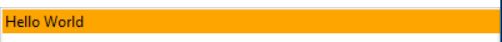
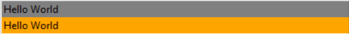
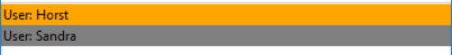

## Basic databinding
Generally almost any attribute the tkinter widget has can be overwritten using databinding. 
Additionally if you create own widgets, you can define additional attributes.

When using expressions, you can use the view public methods, reducers and store data.
Some python built in functions are enabled like: __list__ or __enumerate__.

Dangerous functions like: __eval__ are blocked.

Dict traversals are automatically converted to attributes:

`data["id"]` => `data.id`

### Types
There are 3 different types of data binding.

#### Static
If you just want to assign a static value to an attribute.

```pug
<!-- attribute static = '123' -->
Widget(static="123")
```

#### Expression
You want to define a dynamic computed attribute:

```pug
<!-- attribute dyn = '3' -->
Widget(dyn="{1+2}")
```

#### TwoWay Binding
Attribute is bound to field in the store, once attribute is updated, so will be the field in the store

```pug
Widget(tw="{{name}}")
```

#### Widget Text
Inside a widgets text, you can use dynamic expression by including it in curly brackets:

```pug
<!-- Outputs: Text 3 -->
Widget Text { 1 + 2 } 
``` 


Additionally, all properties from the store are available by default. Instead of using the dict key access method, you can directly reference store properties as attributes.

When writing texts, include the data you want to use in curly brackets, like f-strings.

``` pug tab="Layout"
Label(background="orange") {name} World
```

``` json tab="Data"
{
  "name": "Hello"
}
```



## Inline scripting

Would you like to change a certain behavior depending on the data in the store ? You can use inline python scripting, including data access. The scripting also gets reevaluated every time the data changes.

``` pug tab="Layout"
Label(background="{'grey' if name == 'Hello' else 'orange'}") {name} World
Label(background="{'grey' if name != 'Hello' else 'orange'}") {name} World
```

``` json tab="Data"
{
  "name": "Hello"
}
```



## Nested data mapping

You can iterate the data via the **for** attribute. For each child, a new property **user** will be available, that references the list row.

``` pug tab="Layout"
Box(orient="vertical" for="{user in users if user.age <= 30}")
  Box(orient="horizontal")
    Label(background="{'grey' if user.age < 25 else 'orange'}") User: {user.name}
```

``` json tab="Data"
{
  "users": [
    { "name": "Horst", "age": 30 },
    { "name": "Sandra", "age": 20 },
    { "name": "Andreas", "age": 40 }
  ]
}
```


