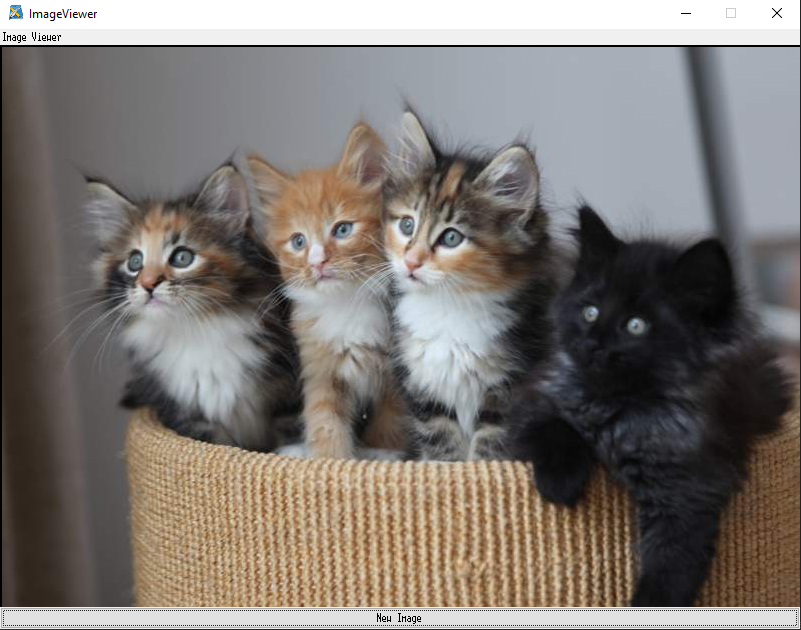
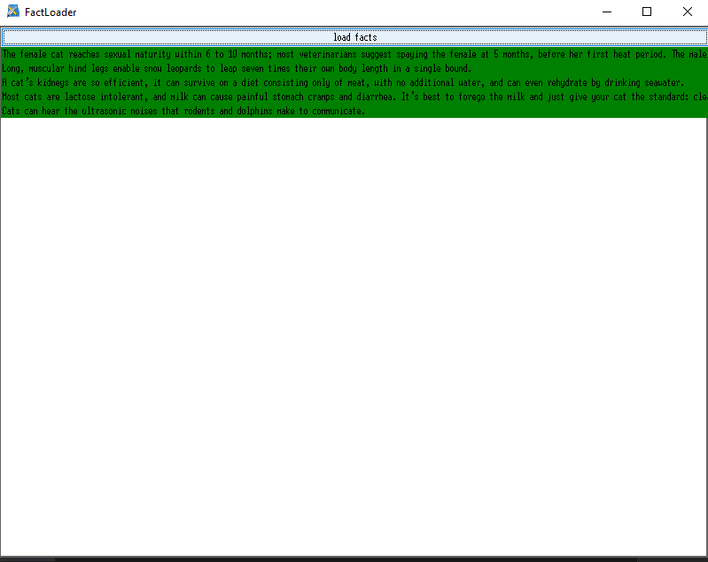
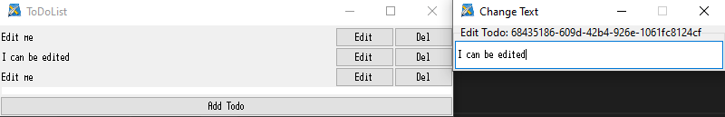

# Showcase

Here are some apps that were designed quick and dirty.

!!! imporant
    For many examples you need additional libraries like: **aiohttp**

## Cat Viewer
This example showcases, how you can create a custom widget, access a remote resource and dynamically load an image in tkinter.



??? Source Code
    ```python
    from layoutx        import app
    from layoutx.store  import create_store
    from layoutx.view   import View, ResizeOption

    store = create_store({
      "SET_IMAGE": lambda state, payload: {**state, **{"data": payload}} 
    }, { "data": "" })

    class ImageShowcase(View):
      geometry = "800x600+200+200"
      title = "ImageViewer"
      resizable = ResizeOption.NONE
      template= """\
    Box
      Label(weight="0") Image Viewer
      ImageViewer(name="image" background="black" imagedata="{data}")
      Button(weight="0" height="20" command="{load_image}") New Image
    """

      async def load_image(self):
        # Find view child widget api not yet finalized
        imageViewer = self._widget.find_first("image")
          
        # Get tkinter attributes
        height  = imageViewer.widget.tk.winfo_height()
        width   = imageViewer.widget.tk.winfo_width()

        import aiohttp
        import io
        from random import randint

        imagedata = None
        session = aiohttp.ClientSession()
        async with session.get(f"http://placekitten.com/{width}/{height}?image={randint(0,17)}") as imageResource:
          from PIL import Image, ImageTk
          load = Image.open(io.BytesIO(await imageResource.read()))
          imagedata = ImageTk.PhotoImage(load)
        await session.close()
        self.store.dispatch("SET_IMAGE", imagedata)

    from layoutx.widgets import Widget
    from tkinter import ttk
    class ImageViewer(Widget):
      def __init__(self, master, **kwargs):
        super().__init__(tk=ttk.Label(master=master), **kwargs)
        self.connect_to_prop("imagedata", self.on_imagedata_changed)
        
      def on_imagedata_changed(self, imagedata):
        if imagedata == '':
          return
        self._tk.configure(image=imagedata)

    app.add_custom_widget("ImageViewer", ImageViewer)

    if __name__ == "__main__":
      app.setup(store=store, rootView=ImageShowcase)
      app.run()
    ```

## Cat Facts
This examples shows, how you could filter dynamically change the view depending on application state.



??? Source Code
    ```python
    from layoutx        import app
    from layoutx.store  import create_store
    from layoutx.view   import View, ResizeOption

    store = create_store({}, {
      "facts": [],
      "loading": False
    })

    class LoadFacts(View):
      geometry  = "800x600+200+200"
      title     = "FactLoader"
      resizable = ResizeOption.BOTH
      template = """\
    ScrollFrame
      Label(if="{loading}") Loading, please wait ...
      Button(command="{load_facts}") load facts
      Box(for="{fact in facts if fact.type == 'cat'}")
        Box(orient="horizontal")
          Label(background="{'grey' if fact.deleted else 'green'}") {fact.text}
    """

      async def load_facts(self):
        self.store.dispatch("SET_VALUE", {
          "path": ["loading"],
          "value": True
        })
        import aiohttp
        session = aiohttp.ClientSession()
        facts_list = []
        async with session.get("https://cat-fact.herokuapp.com/facts/random?animal_type=horse&amount=5") as facts:
          facts_list += await facts.json()
        
        async with session.get("https://cat-fact.herokuapp.com/facts/random?animal_type=cat&amount=5") as facts:
          facts_list += await facts.json()

        await session.close()

        self.store.dispatch("SET_VALUE", {
          "path": ["loading"],
          "value": False
        })

        self.store.dispatch("SET_VALUE", {
          "path": ["facts"],
          "value": facts_list
        })

    if __name__ == "__main__":
      app.setup(store=store, rootView=LoadFacts)
      app.run()
    ```

## ToDo List
A simple todo list a must for every framework.
This also showcases, how you can create a subview for text editing.



??? Source Code
    ```python
    from layoutx        import app
    from layoutx.store  import create_store
    from layoutx.view   import View, ResizeOption
    from uuid           import uuid4

    store = create_store({
      "DELETE_TODO": lambda state, payload: {**state, **{"todos": list(filter(lambda x: x["id"] != payload, state["todos"])) }},
      "ADD_TODO":    lambda state, *_: {**state, **{"todos": state["todos"] + [{ "id": uuid4(), "text": "Edit me" }] }}
    }, {
      "todos": [],
      "selected": -1
    })


    class ChangeToDoText(View):
      geometry  = "300x50+500+500"
      title     = "Change Text"
      resizable = ResizeOption.NONE
      template = """\
    Box Edit Todo: {todos[selected].id}
      Input(value="{{todos[selected].text}}")
    """

    class ToDoList(View):
      geometry  = "500x100+200+200"
      title     = "ToDoList"
      resizable = ResizeOption.BOTH
      template  = """\
    Box
      ScrollFrame To-Do\'s
        Box(orient="vertical" for="{todo in todos}")
          Box(orient="horizontal")
            Label {todo.text}
            Button(weight="0" command="{partial(change_todo, todo.id)}") Edit
            Button(weight="0" command="{partial(DELETE_TODO, todo.id)}") Del
      Button(weight="0" command="{ADD_TODO}") Add Todo
    """
        
      # private attributes
      _editView = None
        
      def change_todo(self, todo_id):
        list_id = next((i for i, x in enumerate(self.store.state["todos"]) if x["id"] == todo_id), -1)
        if list_id == -1:
          return
          
        self.store.dispatch("SET_VALUE", {
          "path": ["selected"],
          "value": list_id
        })
        if not self._editView or self._editView._tk.winfo_exists() == 0:
          self._editView = app.add_view( ChangeToDoText(store=store) ).widget
          self._editView.show()
      
    if __name__ == "__main__":
      app.setup(store=store, rootView=ToDoList)
      app.run()
    ```